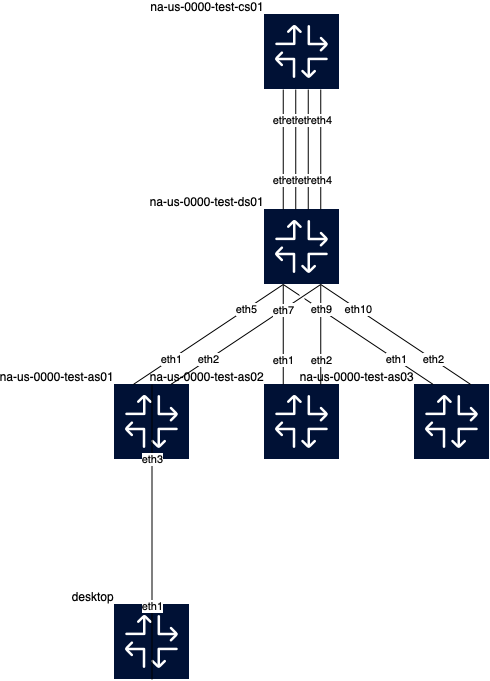

# Containerlabs for Segmentation Migration Training

Tips:
Learn some basic linux!!
- ls
- cd
- mkdir
- pwd
- sudo
- curl
- ip add

Installing
Note: this is specific to the Linux distribution 
Ubuntu/Debian
- sudo apt update
- sudo apt install xxxxx
- sudo apt install -y iproute2 iputils-ping

Command line Editor
- vi

Learn & Practice!
https://vimschool.netlify.app/introduction/vimtutor/

### Containerlab Topology for practicing Segmentation activities
cds-seg.clab.yml

This topology models a standard 3-tier core/distribution/access network and includes one "user device"
so we can understand the "user" end of things.

We will use this lab to 
1. review the work needed to provision a new subnet/vlan and 
2. to review the steps needed to move a user device to a different subnet/vlan.

### Getting the lab to your Virtual Machine

Using the git clone command:
`git clone https://github.com/cldeluna/clab-ceos-segmigration.git`

will create a new directory with the repository name and place the contents of the repository in that directory.


```bash
claudia@ubuntu:~/containerlabs$ git clone https://github.com/cldeluna/clab-ceos-segmigration.git
Cloning into 'clab-ceos-segmigration'...
remote: Enumerating objects: 17, done.
remote: Counting objects: 100% (17/17), done.
remote: Compressing objects: 100% (11/11), done.
remote: Total 17 (delta 6), reused 15 (delta 4), pack-reused 0
Receiving objects: 100% (17/17), 31.76 KiB | 813.00 KiB/s, done.
Resolving deltas: 100% (6/6), done.
claudia@ubuntu:~/containerlabs$ ls -al
total 44
drwxrwxr-x 11 claudia claudia 4096 Jul 28 17:09 .
drwxr-x---  8 claudia claudia 4096 Jul 28 15:17 ..
drwxrwxr-x  5 claudia claudia 4096 Jul 28 14:28 cds-dhcp
drwxrwxr-x  3 claudia claudia 4096 Jul 28 16:47 cds-seg
drwxrwxr-x  3 claudia claudia 4096 Jul 28 17:09 clab-ceos-segmigration  # <---New Directory
drwxrwxr-x  3 claudia claudia 4096 May 14 18:40 clab-quickstart
drwxrwxr-x  3 claudia claudia 4096 Jul 27 21:50 images
drwxrwxr-x  3 claudia claudia 4096 May 16 17:36 new_l2vlan_lab
drwxrwxr-x  4 claudia claudia 4096 Jul 25 12:45 seg-mig-nodummy
drwxrwxr-x  3 claudia claudia 4096 Jul 25 12:14 seg-migration
claudia@ubuntu:~/containerlabs$

```

Once you have cloned the lab repository, move into the new directory and deploy the lab.
Note that you will have to specify which lab you want because there are several lab YAML files 
in the repository


```bash
claudia@ubuntu:~/containerlabs$ pwd
/home/claudia/containerlabs
claudia@ubuntu:~/containerlabs$ ls -al
total 32
drwxrwxr-x 8 claudia claudia 4096 Jul 28 17:27 .
drwxr-x--- 8 claudia claudia 4096 Jul 28 15:17 ..
drwxrwxr-x 5 claudia claudia 4096 Jul 28 14:28 cds-dhcp
drwxrwxr-x 3 claudia claudia 4096 Jul 28 16:47 cds-seg
drwxrwxr-x 3 claudia claudia 4096 May 14 18:40 clab-quickstart
drwxrwxr-x 3 claudia claudia 4096 Jul 27 21:50 images
drwxrwxr-x 3 claudia claudia 4096 May 16 17:36 new_l2vlan_lab
drwxrwxr-x 3 claudia claudia 4096 Jul 25 12:14 seg-migration
claudia@ubuntu:~/containerlabs$ git clone https://github.com/cldeluna/clab-ceos-segmigration.git
Cloning into 'clab-ceos-segmigration'...
remote: Enumerating objects: 17, done.
remote: Counting objects: 100% (17/17), done.
remote: Compressing objects: 100% (11/11), done.
remote: Total 17 (delta 6), reused 15 (delta 4), pack-reused 0
Receiving objects: 100% (17/17), 31.76 KiB | 722.00 KiB/s, done.
Resolving deltas: 100% (6/6), done.
claudia@ubuntu:~/containerlabs$ ls -al
total 36
drwxrwxr-x 9 claudia claudia 4096 Jul 28 17:28 .
drwxr-x--- 8 claudia claudia 4096 Jul 28 15:17 ..
drwxrwxr-x 5 claudia claudia 4096 Jul 28 14:28 cds-dhcp
drwxrwxr-x 3 claudia claudia 4096 Jul 28 16:47 cds-seg
drwxrwxr-x 3 claudia claudia 4096 Jul 28 17:28 clab-ceos-segmigration
drwxrwxr-x 3 claudia claudia 4096 May 14 18:40 clab-quickstart
drwxrwxr-x 3 claudia claudia 4096 Jul 27 21:50 images
drwxrwxr-x 3 claudia claudia 4096 May 16 17:36 new_l2vlan_lab
drwxrwxr-x 3 claudia claudia 4096 Jul 25 12:14 seg-migration
claudia@ubuntu:~/containerlabs$ cd clab-ceos-segmigration/
claudia@ubuntu:~/containerlabs/clab-ceos-segmigration$ ls
README.md  cds-seg.clab.drawio.png  cds-seg.clab.yml  ceos-lab.clab.yml  na-us-0000-test-as01.cfg  na-us-0000-test-as02.cfg  na-us-0000-test-as03.cfg  na-us-0000-test-cs01.cfg  na-us-0000-test-ds01.cfg
claudia@ubuntu:~/containerlabs/clab-ceos-segmigration$ sudo clab deploy -t cds-seg.clab.yml
```


`sudo clab deploy -t cds-seg.clab.yml`

```bash
claudia@ubuntu:~/containerlabs/clab-ceos-segmigration$ sudo clab deploy -t cds-seg.clab.yml
INFO[0000] Containerlab v0.56.0 started
INFO[0000] Parsing & checking topology file: cds-seg.clab.yml
INFO[0000] Creating docker network: Name="clab", IPv4Subnet="172.20.20.0/24", IPv6Subnet="2001:172:20:20::/64", MTU=1500
INFO[0000] Creating lab directory: /home/claudia/containerlabs/clab-ceos-segmigration/clab-cds-seg
INFO[0000] Creating container: "na-us-0000-test-as02"
INFO[0000] Creating container: "na-us-0000-test-cs01"
INFO[0000] Creating container: "na-us-0000-test-ds01"
INFO[0000] Creating container: "na-us-0000-test-as01"
INFO[0000] Creating container: "na-us-0000-test-as03"
INFO[0002] Creating container: "desktop"
INFO[0004] Created link: na-us-0000-test-cs01:eth1 <--> na-us-0000-test-ds01:eth1
INFO[0004] Created link: na-us-0000-test-cs01:eth2 <--> na-us-0000-test-ds01:eth2
INFO[0004] Running postdeploy actions for Arista cEOS 'na-us-0000-test-as02' node
INFO[0005] Created link: na-us-0000-test-cs01:eth3 <--> na-us-0000-test-ds01:eth3
INFO[0005] Created link: na-us-0000-test-ds01:eth5 <--> na-us-0000-test-as01:eth1
INFO[0005] Created link: na-us-0000-test-cs01:eth4 <--> na-us-0000-test-ds01:eth4
INFO[0005] Running postdeploy actions for Arista cEOS 'na-us-0000-test-cs01' node
INFO[0005] Created link: desktop:eth1 <--> na-us-0000-test-as01:eth3
INFO[0005] Created link: na-us-0000-test-ds01:eth6 <--> na-us-0000-test-as01:eth2
INFO[0006] Created link: na-us-0000-test-ds01:eth7 <--> na-us-0000-test-as02:eth1
INFO[0006] Created link: na-us-0000-test-ds01:eth8 <--> na-us-0000-test-as02:eth2
INFO[0007] Created link: na-us-0000-test-ds01:eth9 <--> na-us-0000-test-as03:eth1
INFO[0007] Created link: na-us-0000-test-ds01:eth10 <--> na-us-0000-test-as03:eth2
INFO[0007] Running postdeploy actions for Arista cEOS 'na-us-0000-test-ds01' node
INFO[0007] Running postdeploy actions for Arista cEOS 'na-us-0000-test-as01' node
INFO[0007] Running postdeploy actions for Arista cEOS 'na-us-0000-test-as03' node
WARN[0075] Cannot parse export template /etc/containerlab/templates/export/auto.tmpl: template: auto.tmpl:49:18: executing "auto.tmpl" at <index $eps 1>: error calling index: reflect: slice index out of range
INFO[0075] Adding containerlab host entries to /etc/hosts file
INFO[0075] Adding ssh config for containerlab nodes
+---+-----------------------------------+--------------+---------------+-------+---------+-----------------+----------------------+
| # |               Name                | Container ID |     Image     | Kind  |  State  |  IPv4 Address   |     IPv6 Address     |
+---+-----------------------------------+--------------+---------------+-------+---------+-----------------+----------------------+
| 1 | clab-cds-seg-desktop              | c08bb91c8423 | ubuntu:latest | linux | running | 172.20.20.2/24  | 2001:172:20:20::7/64 |
| 2 | clab-cds-seg-na-us-0000-test-as01 | 92a4f5d3cdcf | ceos:4.32.1F  | ceos  | running | 172.20.20.31/24 | 2001:172:20:20::3/64 |
| 3 | clab-cds-seg-na-us-0000-test-as02 | 551c47850120 | ceos:4.32.1F  | ceos  | running | 172.20.20.32/24 | 2001:172:20:20::2/64 |
| 4 | clab-cds-seg-na-us-0000-test-as03 | 96c4473726fe | ceos:4.32.1F  | ceos  | running | 172.20.20.33/24 | 2001:172:20:20::5/64 |
| 5 | clab-cds-seg-na-us-0000-test-cs01 | 959123e6f3fa | ceos:4.32.1F  | ceos  | running | 172.20.20.10/24 | 2001:172:20:20::4/64 |
| 6 | clab-cds-seg-na-us-0000-test-ds01 | 1070af10995b | ceos:4.32.1F  | ceos  | running | 172.20.20.20/24 | 2001:172:20:20::6/64 |
+---+-----------------------------------+--------------+---------------+-------+---------+-----------------+----------------------+
claudia@ubuntu:~/containerlabs/clab-ceos-segmigration$
```

### Topology



How to read the topology file:

First, a default image of Arista ceos:4.32.1F is defined.  
If a node section does not specify an image then that Arista image will be used to spin up that device.

In addition to the 5 Arista EOS switches, the lab includes one "desktop" node which will use
the ubuntu:latest image ()

```yaml
name: cds-seg

topology:
  defaults:
    kind: ceos
    image: ceos:4.32.1F
  nodes:
    desktop:
      kind: linux
      image: ubuntu:latest
      cmd: sleep infinity
    na-us-0000-test-cs01:
      kind: ceos
      mgmt-ipv4: 172.20.20.10
      startup-config: ./na-us-0000-test-cs01.cfg
    na-us-0000-test-ds01:
      kind: ceos
      mgmt-ipv4: 172.20.20.20
      startup-config: ./na-us-0000-test-ds01.cfg
    na-us-0000-test-as01:
      kind: ceos
      mgmt-ipv4: 172.20.20.31
      startup-config: ./na-us-0000-test-as01.cfg
    na-us-0000-test-as02:
      kind: ceos
      mgmt-ipv4: 172.20.20.32
      startup-config: ./na-us-0000-test-as02.cfg
    na-us-0000-test-as03:
      kind: ceos
      mgmt-ipv4: 172.20.20.33
      startup-config: ./na-us-0000-test-as03.cfg

  links:
    - endpoints: ["na-us-0000-test-cs01:eth1", "na-us-0000-test-ds01:eth1"]
    - endpoints: ["na-us-0000-test-cs01:eth2", "na-us-0000-test-ds01:eth2"]
    - endpoints: ["na-us-0000-test-cs01:eth3", "na-us-0000-test-ds01:eth3"]
    - endpoints: ["na-us-0000-test-cs01:eth4", "na-us-0000-test-ds01:eth4"]
    - endpoints: ["na-us-0000-test-ds01:eth5", "na-us-0000-test-as01:eth1"]
    - endpoints: ["na-us-0000-test-ds01:eth6", "na-us-0000-test-as01:eth2"]
    - endpoints: ["na-us-0000-test-ds01:eth7", "na-us-0000-test-as02:eth1"]
    - endpoints: ["na-us-0000-test-ds01:eth8", "na-us-0000-test-as02:eth2"]
    - endpoints: ["na-us-0000-test-ds01:eth9", "na-us-0000-test-as03:eth1"]
    - endpoints: ["na-us-0000-test-ds01:eth10", "na-us-0000-test-as03:eth2"]
    - endpoints: ["desktop:eth1", "na-us-0000-test-as01:eth3"]


    - type: dummy
      endpoint:
        node: na-us-0000-test-as01
        interface: eth4
... <snip>
```


#### Credentials
ceos
admin/admin
ubuntu desktop

```bash
claudia@ubuntu:~/containerlabs/cds-seg$ docker exec -it clab-cds-seg-desktop bash
root@desktop:/# # You are now in the Ubuntu container
root@desktop:/# apt update

```

```bash
# You wil be logged in as root so you don't need sudo to elevate your privileges
# are root 
apt update
apt install -y iproute2 iputils-ping

ip addr add 192.168.100.33/24 dev eth1
ip link set eth1 up
```


On the switch side, you'll need to configure the corresponding interface. 
You can access the switch CLI and configure it as needed:

```bash
docker exec -it clab-<lab-name>-switch Cli
# or SSH
ssh admin@clab-<lab-name>-switch

```

```
root@desktop:/# history
    1  apt update
    2  apt install -y iproute2 iputils-ping
    3  ip addr add 192.168.100.33/24 dev eth1
    4  ip link set eth1 up
    5  ip add
    6  ping 192.168.100.5
    7  ping 192.168.100.1

```


``` bash
claudia@ubuntu:~/containerlabs/clab-ceos-segmigration$ sudo clab inspect
[sudo] password for claudia:
INFO[0000] Parsing & checking topology file: cds-seg.clab.yml
+---+-----------------------------------+--------------+---------------+-------+---------+-----------------+----------------------+
| # |               Name                | Container ID |     Image     | Kind  |  State  |  IPv4 Address   |     IPv6 Address     |
+---+-----------------------------------+--------------+---------------+-------+---------+-----------------+----------------------+
| 1 | clab-cds-seg-desktop              | 2120629b0541 | ubuntu:latest | linux | running | 172.20.20.2/24  | 2001:172:20:20::7/64 |
| 2 | clab-cds-seg-na-us-0000-test-as01 | f8cd269a6877 | ceos:4.32.1F  | ceos  | running | 172.20.20.31/24 | 2001:172:20:20::3/64 |
| 3 | clab-cds-seg-na-us-0000-test-as02 | d34416e9a14f | ceos:4.32.1F  | ceos  | running | 172.20.20.32/24 | 2001:172:20:20::2/64 |
| 4 | clab-cds-seg-na-us-0000-test-as03 | 77408daa8610 | ceos:4.32.1F  | ceos  | running | 172.20.20.33/24 | 2001:172:20:20::4/64 |
| 5 | clab-cds-seg-na-us-0000-test-cs01 | 1c8f30bee2f7 | ceos:4.32.1F  | ceos  | running | 172.20.20.10/24 | 2001:172:20:20::5/64 |
| 6 | clab-cds-seg-na-us-0000-test-ds01 | c460894d8a6d | ceos:4.32.1F  | ceos  | running | 172.20.20.20/24 | 2001:172:20:20::6/64 |
+---+-----------------------------------+--------------+---------------+-------+---------+-----------------+----------------------+
claudia@ubuntu:~/containerlabs/clab-ceos-segmigration$
```
