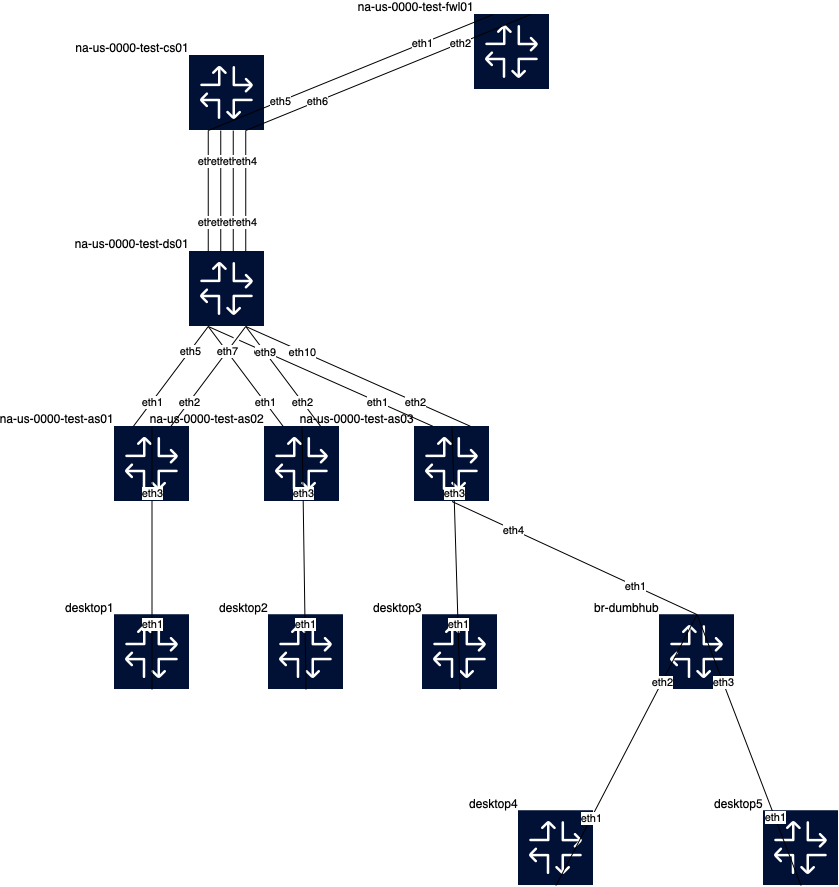

# Mock Firewall Lab

This lab topology contains a streamlined 3-Tier design (Core/Distribution/Access) 
and a cEOS device acting as a "mock" firewall only to showcase routing.





1.  Create a Linux bridge on your Linux VM to simulate a dumb hub in the Containerlab Topology
```bash
sudo ip link add name br-dumbhub type bridge
sudo ip link set dev br-dumbhub up 
````
```bash
# Verify the bridge has been created
sudo brctl show br-dumbhub

# Output
bridge name	bridge id		STP enabled	interfaces
br-dumbhub		8000.8e3bd5bfa0f4	no		eth1
```

Tip:  
If your system does not recognize the `brctl` command, you need to install the package:
```bash
sudo apt update
sudo apt install bridge-utils
```

2. Make sure you don't have a lab running
From the directory
```bash
# Check to see if a lab is running
sudo clab inspect
# Destroy the lab
sudo clab destroy -a
```

3. Clone the segmentation lab repository if you don't already have it or refresh your existing one 
```bash
# Clone (this will give you an error if you already have a clab-ceos-segmigration directory
git clone https://github.com/cldeluna/clab-ceos-segmigration.git

# Refresh/Synch (this will give you an error if you have made any changes to any file under revision control)
git pull
```

4. Move into seg_w_fwl_nested directory and start the lab.  Will take about ~2 minutes to spin up.

```bash


sudo clab deploy --reconfigure

# Final output

+----+----------------------------------------+--------------+---------------+-------+---------+-----------------+----------------------+
| #  |                  Name                  | Container ID |     Image     | Kind  |  State  |  IPv4 Address   |     IPv6 Address     |
+----+----------------------------------------+--------------+---------------+-------+---------+-----------------+----------------------+
|  1 | clab-cds-seg-fwl-desktop1              | 2588d2069880 | ubuntu:latest | linux | running | 172.20.20.6/24  | 2001:172:20:20::c/64 |
|  2 | clab-cds-seg-fwl-desktop2              | 73db765fec14 | ubuntu:latest | linux | running | 172.20.20.5/24  | 2001:172:20:20::b/64 |
|  3 | clab-cds-seg-fwl-desktop3              | 22a9b90869f1 | ubuntu:latest | linux | running | 172.20.20.2/24  | 2001:172:20:20::8/64 |
|  4 | clab-cds-seg-fwl-desktop4              | 0ee77b55c714 | alpine:latest | linux | running | 172.20.20.3/24  | 2001:172:20:20::9/64 |
|  5 | clab-cds-seg-fwl-desktop5              | b22dea54c43d | alpine:latest | linux | running | 172.20.20.4/24  | 2001:172:20:20::a/64 |
|  6 | clab-cds-seg-fwl-na-us-0000-test-as01  | e91883fea677 | ceos:4.32.1F  | ceos  | running | 172.20.20.31/24 | 2001:172:20:20::5/64 |
|  7 | clab-cds-seg-fwl-na-us-0000-test-as02  | 9e7d05f3db7d | ceos:4.32.1F  | ceos  | running | 172.20.20.32/24 | 2001:172:20:20::4/64 |
|  8 | clab-cds-seg-fwl-na-us-0000-test-as03  | e5b087deed4d | ceos:4.32.1F  | ceos  | running | 172.20.20.33/24 | 2001:172:20:20::3/64 |
|  9 | clab-cds-seg-fwl-na-us-0000-test-cs01  | 69fd4813b9cd | ceos:4.32.1F  | ceos  | running | 172.20.20.10/24 | 2001:172:20:20::7/64 |
| 10 | clab-cds-seg-fwl-na-us-0000-test-ds01  | 55582ac428d8 | ceos:4.32.1F  | ceos  | running | 172.20.20.20/24 | 2001:172:20:20::2/64 |
| 11 | clab-cds-seg-fwl-na-us-0000-test-fwl01 | 8360db4a4eb7 | ceos:4.32.1F  | ceos  | running | 172.20.20.66/24 | 2001:172:20:20::6/64 |
+----+----------------------------------------+--------------+---------------+-------+---------+-----------------+----------------------+

real	1m48.914s
user	0m0.003s
sys	0m0.007s

```


#### Clone Steps

```bash

claudia@ubuntu:~/containerlabs$ ls
cds-dhcp  cds-seg  clab-ceos-segmigration  clab-quickstart  images  new_l2vlan_lab  seg-migration  test
claudia@ubuntu:~/containerlabs$ mkdir test2
claudia@ubuntu:~/containerlabs$ cd test2
claudia@ubuntu:~/containerlabs/test2$
claudia@ubuntu:~/containerlabs/test2$
claudia@ubuntu:~/containerlabs/test2$ ls
claudia@ubuntu:~/containerlabs/test2$ sudo brctl show br-dumbhub
bridge name	bridge id		STP enabled	interfaces
br-dumbhub		8000.8e3bd5bfa0f4	no
claudia@ubuntu:~/containerlabs/test2$ git clone https://github.com/cldeluna/clab-ceos-segmigration.git
Cloning into 'clab-ceos-segmigration'...
remote: Enumerating objects: 108, done.
remote: Counting objects: 100% (108/108), done.
remote: Compressing objects: 100% (64/64), done.
remote: Total 108 (delta 66), reused 82 (delta 40), pack-reused 0
Receiving objects: 100% (108/108), 216.28 KiB | 2.54 MiB/s, done.
Resolving deltas: 100% (66/66), done.
claudia@ubuntu:~/containerlabs/test2$ ls
clab-ceos-segmigration
claudia@ubuntu:~/containerlabs/test2$ cd clab-ceos-segmigration/
claudia@ubuntu:~/containerlabs/test2/clab-ceos-segmigration$ ls
README.md  base  cds-seg.clab.drawio.png  cds-seg.clab.yml  dummy_lab  na-us-0000-test-as01.cfg  na-us-0000-test-as02.cfg  na-us-0000-test-as03.cfg  na-us-0000-test-cs01.cfg  na-us-0000-test-ds01.cfg  seg_w_fwl  seg_w_fwl_nested
claudia@ubuntu:~/containerlabs/test2/clab-ceos-segmigration$ cd seg_w_fwl_nested/
claudia@ubuntu:~/containerlabs/test2/clab-ceos-segmigration/seg_w_fwl_nested$ ls
MOCK_FWL_LAB_README.md   cds-seg-fwl-nestedbr.clab-updated.drawio  na-us-0000-test-as01.cfg  na-us-0000-test-as03.cfg  na-us-0000-test-cs01.cfg  na-us-0000-test-fwl01.cfg  xArchive
cds-seg-fwl-br.clab.yml  cds-seg-fwl-nestedbr.clab.drawio.png      na-us-0000-test-as02.cfg  na-us-0000-test-as04.cfg  na-us-0000-test-ds01.cfg  prework01.txt
claudia@ubuntu:~/containerlabs/test2/clab-ceos-segmigration/seg_w_fwl_nested$ sudo clab deploy --reconfigure

```


```bash

ssh-keygen -f "/home/claudia/.ssh/known_hosts" -R "172.20.20.33"
ssh-keygen -f "/home/claudia/.ssh/known_hosts" -R "172.20.20.32"
ssh-keygen -f "/home/claudia/.ssh/known_hosts" -R "172.20.20.31"
ssh-keygen -f "/home/claudia/.ssh/known_hosts" -R "172.20.20.10"
ssh-keygen -f "/home/claudia/.ssh/known_hosts" -R "172.20.20.20"


claudia@ubuntu:~/containerlabs/test/clab-ceos-segmigration/seg_w_fwl$ git pull
Updating e19b920..c9ca5cf
error: Your local changes to the following files would be overwritten by merge:
	seg_w_fwl/cds-seg-fwl.clab.yml
Please commit your changes or stash them before you merge.
Aborting

```


```bash
na-us-0000-test-as03#show mac  address-table
          Mac Address Table
------------------------------------------------------------------

Vlan    Mac Address       Type        Ports      Moves   Last Move
----    -----------       ----        -----      -----   ---------
 102    aac1.abbe.14c5    DYNAMIC     Et3        1       0:00:19 ago
 102    aac1.abd5.a851    DYNAMIC     Et4        1       0:00:00 ago
 102    aac1.abf7.7e34    DYNAMIC     Et4        1       0:00:14 ago
```


#### Alpine Linux Desktops
```shell


claudia@ubuntu:~/containerlabs/test/clab-ceos-segmigration/seg_w_fwl$ docker exec -it clab-cds-seg-fwl-desktop4 sh

ip addr add 192.168.102.34/24 dev eth1


/ #
/ #
/ # ip add
1: lo: <LOOPBACK,UP,LOWER_UP> mtu 65536 qdisc noqueue state UNKNOWN qlen 1000
    link/loopback 00:00:00:00:00:00 brd 00:00:00:00:00:00
    inet 127.0.0.1/8 scope host lo
       valid_lft forever preferred_lft forever
    inet6 ::1/128 scope host
       valid_lft forever preferred_lft forever
2325: eth1@if2326: <BROADCAST,MULTICAST,UP,LOWER_UP,M-DOWN> mtu 9500 qdisc noqueue state UP
    link/ether aa:c1:ab:d5:a8:51 brd ff:ff:ff:ff:ff:ff
    inet6 fe80::a8c1:abff:fed5:a851/64 scope link
       valid_lft forever preferred_lft forever
2338: eth0@if2339: <BROADCAST,MULTICAST,UP,LOWER_UP,M-DOWN> mtu 1500 qdisc noqueue state UP
    link/ether 02:42:ac:14:14:03 brd ff:ff:ff:ff:ff:ff
    inet 172.20.20.3/24 brd 172.20.20.255 scope global eth0
       valid_lft forever preferred_lft forever
    inet6 2001:172:20:20::9/64 scope global flags 02
       valid_lft forever preferred_lft forever
    inet6 fe80::42:acff:fe14:1403/64 scope link
       valid_lft forever preferred_lft forever
/ # ip addr add 192.168.102.34/24 dev eth1
/ # ip add
1: lo: <LOOPBACK,UP,LOWER_UP> mtu 65536 qdisc noqueue state UNKNOWN qlen 1000
    link/loopback 00:00:00:00:00:00 brd 00:00:00:00:00:00
    inet 127.0.0.1/8 scope host lo
       valid_lft forever preferred_lft forever
    inet6 ::1/128 scope host
       valid_lft forever preferred_lft forever
2325: eth1@if2326: <BROADCAST,MULTICAST,UP,LOWER_UP,M-DOWN> mtu 9500 qdisc noqueue state UP
    link/ether aa:c1:ab:d5:a8:51 brd ff:ff:ff:ff:ff:ff
    inet 192.168.102.34/24 scope global eth1
       valid_lft forever preferred_lft forever
    inet6 fe80::a8c1:abff:fed5:a851/64 scope link
       valid_lft forever preferred_lft forever
2338: eth0@if2339: <BROADCAST,MULTICAST,UP,LOWER_UP,M-DOWN> mtu 1500 qdisc noqueue state UP
    link/ether 02:42:ac:14:14:03 brd ff:ff:ff:ff:ff:ff
    inet 172.20.20.3/24 brd 172.20.20.255 scope global eth0
       valid_lft forever preferred_lft forever
    inet6 2001:172:20:20::9/64 scope global flags 02
       valid_lft forever preferred_lft forever
    inet6 fe80::42:acff:fe14:1403/64 scope link
       valid_lft forever preferred_lft forever

/ # ping 192.168.102.1
PING 192.168.102.1 (192.168.102.1): 56 data bytes
64 bytes from 192.168.102.1: seq=0 ttl=64 time=3.142 ms
64 bytes from 192.168.102.1: seq=1 ttl=64 time=1.512 ms
64 bytes from 192.168.102.1: seq=2 ttl=64 time=1.689 ms
64 bytes from 192.168.102.1: seq=3 ttl=64 time=1.590 ms
64 bytes from 192.168.102.1: seq=4 ttl=64 time=1.616 ms
^C
--- 192.168.102.1 ping statistics ---
5 packets transmitted, 5 packets received, 0% packet loss
round-trip min/avg/max = 1.512/1.909/3.142 ms

```